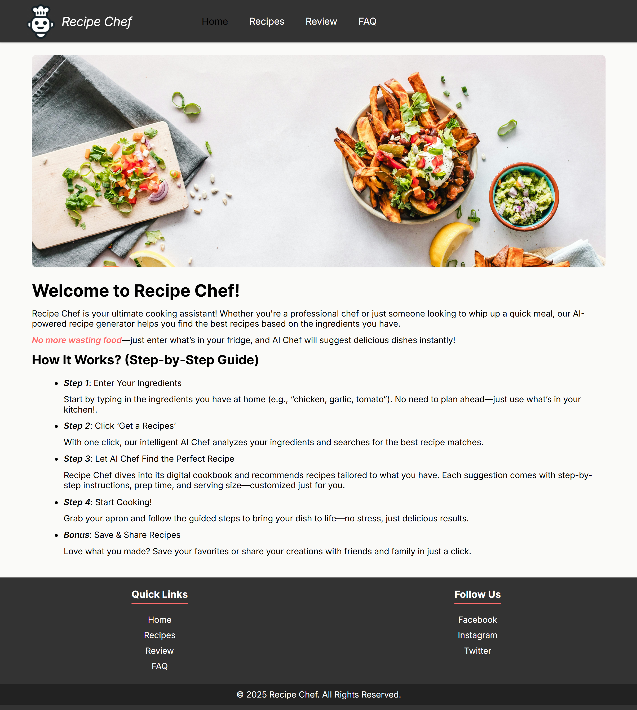
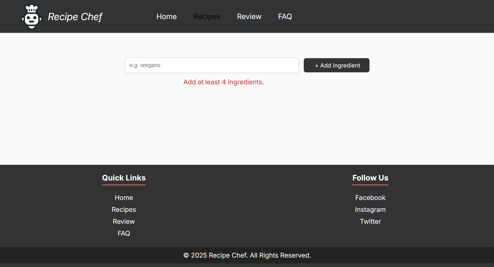
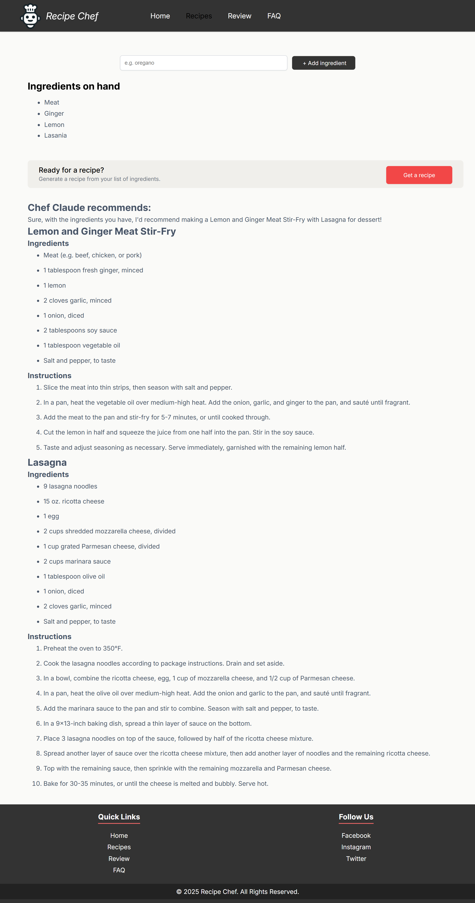
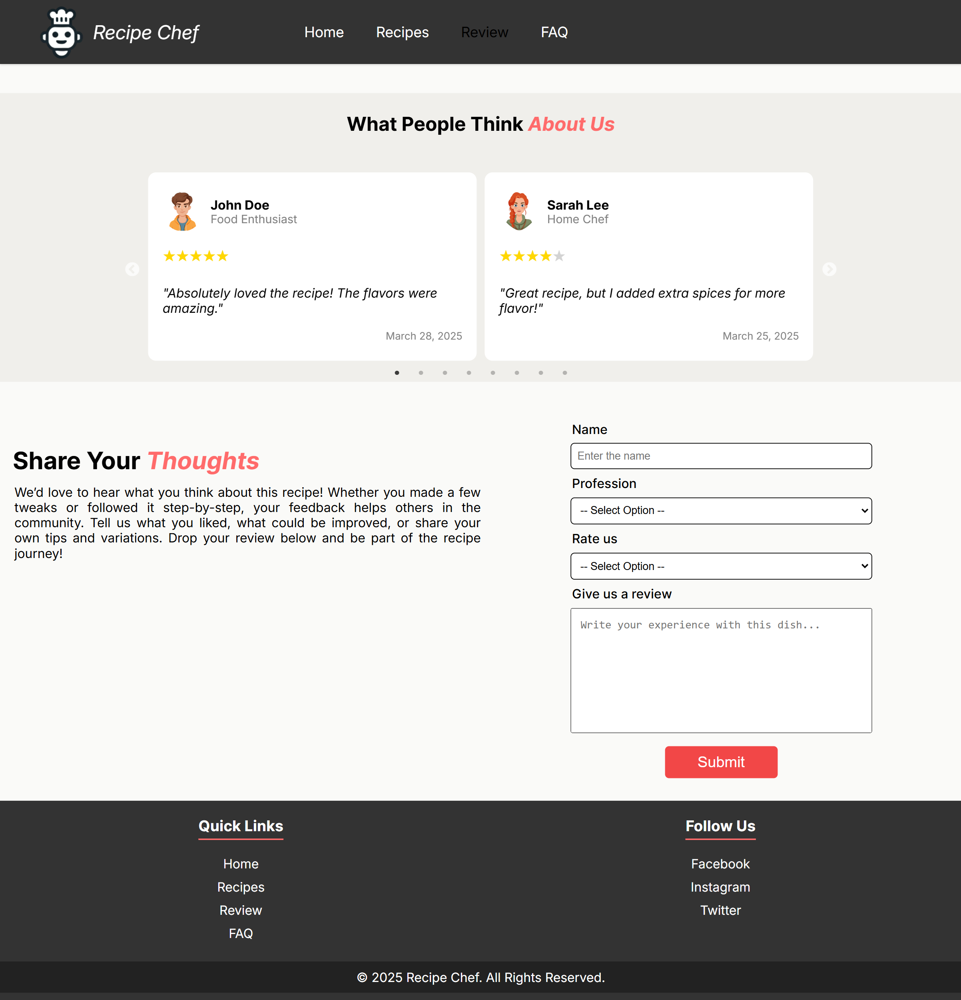

# Recipe Chef 🍳

An intelligent AI-powered recipe suggestion web application that transforms your available ingredients into delicious meal possibilities.

## 🌟 Features

- **Smart Recipe Suggestions**: Input your available ingredients and get personalized recipe recommendations
- **AI-Powered Matching**: Advanced algorithms analyze your ingredients to suggest the best possible recipes
- **Ingredient-Based Search**: Find recipes based on what you already have in your kitchen
- **User-Friendly Interface**: Clean, intuitive design for seamless recipe discovery
- **Recipe Details**: Comprehensive cooking instructions, prep time, and difficulty levels

## 🚀 Demo

[Live Demo](ai-recipe-chef.netlify.app) 

## 🛠️ Tech Stack

- **Frontend**: React.js
- **Styling**: Vanilla CSS
- **API Integration**: Recipe/Food APIs for ingredient-based suggestions
- **Deployment**: Vercel/Netlify (or your preferred hosting platform)

## 📋 Prerequisites

Before you begin, ensure you have the following installed:
- [Node.js](https://nodejs.org/) (version 14.0 or higher)
- [npm](https://www.npmjs.com/) or [yarn](https://yarnpkg.com/)
- API key from your chosen recipe API provider

### Getting API Keys
You'll need to obtain an API key from a recipe service provider. Popular options include:

- [Hugging Face API](https://huggingface.co/docs/api-inference/index) – Access ML models for tasks via simple API calls. 
- [Spoonacular API](https://spoonacular.com/food-api) - Comprehensive food and recipe data
- [Edamam Recipe API](https://developer.edamam.com/edamam-recipe-api) - Extensive recipe database
- [TheMealDB API](https://www.themealdb.com/api.php) - Free recipe API

## 🔧 Installation

1. **Clone the repository**
   ```bash
   git clone https://github.com/IM-GHULAM-MUSTAFA/ai-recipe-chef
   cd ai-recipe-chef
   ```

2. **Install dependencies**
   ```bash
   npm install
   # or
   yarn install
   ```

3. **Set up environment variables**
   ```bash
   # Copy the example environment file
   cp .env.example .env
   ```
   
   Open the `.env` file and replace the placeholder values with your actual API keys:
   ```env
   # Replace 'your_api_key_here' with your actual API key
   VITE_API_KEY=your_huggingface_api_key_here
   ```
   
   **Important**: Never commit your `.env` file to version control. It's already included in `.gitignore`.

4. **Start the development server**
   ```bash
   npm start
   # or
   yarn start
   ```

5. **Open your browser**
   Navigate to `http://localhost:3000`

## 🎯 Usage

1. **Enter Your Ingredients**: Type in the ingredients you have available `at least four ingredients.`
3. **Get Suggestions**: Receive AI-powered recipe recommendations
4. **View Recipe Details**: See full instructions and ingredients


## 🔌 API Integration

This application integrates with external recipe APIs to fetch recipe suggestions based on user ingredients.

### Supported APIs
- Hugging Face API
- Spoonacular API
- Edamam Recipe API
- TheMealDB API
- Or your preferred recipe API

### Example API Call Structure

```javascript
// services/apiService.js
const apiKey = import.meta.env.VITE_API_KEY;

export async function getRecipeFromMistral(ingredientsArr) {
    const ingredientsString = ingredientsArr.join(", ")
    try {
        const response = await hf.chatCompletion({
            model: "mistralai/Mixtral-8x7B-Instruct-v0.1",
            messages: [
                { role: "system", content: SYSTEM_PROMPT },
                { role: "user", content: `I have ${ingredientsString}. Please give me a recipe you'd recommend I make!` },
            ],
            max_tokens: 1024,
        })
        return response.choices[0].message.content
    } catch (err) {
        console.error(err.message)
    }
}

export { fetchRecipesByIngredients };
```

**Note**: Make sure to add your API key to the `.env` file as described in the installation section.

## 🧪 Testing

Run the test suite:

```bash
# Run all tests
npm test

# Run tests in watch mode
npm run test:watch

# Run tests with coverage
npm run test:coverage
```

## 🚀 Deployment

### Using Vercel

1. Push your code to GitHub
2. Visit [Vercel](https://vercel.com/) and import your repository
3. Add environment variables in Vercel dashboard (if using API keys)
4. Deploy automatically

### Using Netlify

1. Push your code to GitHub
2. Visit [Netlify](https://netlify.com/) and connect your repository
3. Add environment variables in Netlify dashboard
4. Build command: `npm run build`
5. Publish directory: `build`

### Manual Build

```bash
# Create production build
npm run build

# The build folder contains the static files ready for deployment
```

## 📸 Screenshots

### Home Page

### Recipe Page

### Recipe Details

### Review Page


## 🤝 Contributing

Contributions are welcome! Please feel free to submit a Pull Request.

1. Fork the project
2. Create your feature branch (`git checkout -b feature/AmazingFeature`)
3. Commit your changes (`git commit -m 'Add some AmazingFeature'`)
4. Push to the branch (`git push origin feature/AmazingFeature`)
5. Open a Pull Request


## 👥 Authors

- **Ghulam Mustafa** - *Initial work* - [IM-GHULAM-MUSTAFA](https://github.com/IM-GHULAM-MUSTAFA)

## 🙏 Acknowledgments

- Recipe data provided by [Your chosen Recipe API]
- React.js community for excellent documentation
- Icons and images from [your source]
- Inspiration from various cooking and recipe applications

## 📞 Support

If you have any questions or need help, please:

- Open an issue on GitHub
- Email: ghulam.mustafa7154@gmail.com

---

**Made with ❤️ by [Ghulam Mustafa]**

---

*Last updated: [4-June-2025]*